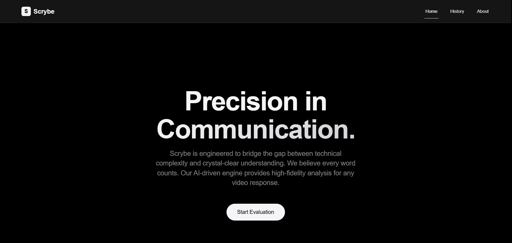
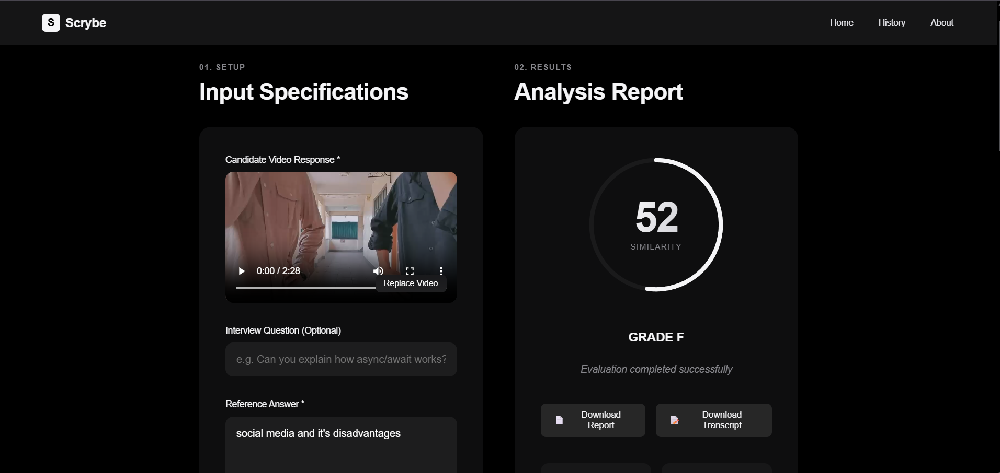
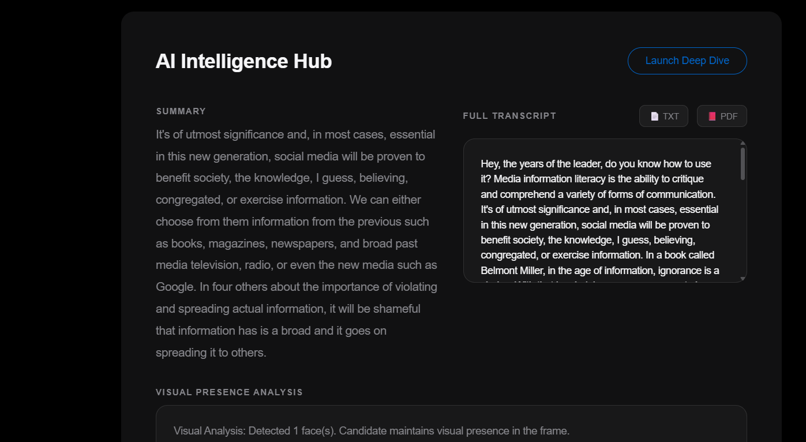
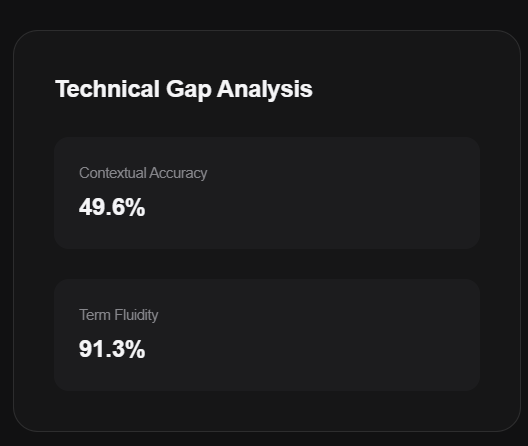

<div align="center">

  <!-- Logo -->
  

  <h1>Scrybe.IO</h1>
  <p><strong>AI-powered speech &amp; presentation evaluator</strong></p>
  <p>Upload a video or audio response, and Scrybe transcribes it, scores it against a reference answer across five rubrics, and gives you structured, actionable feedback — in seconds.</p>

  <!-- Badges -->
  <p>
    <a href="https://github.com/MoulendraBalaji/Scrybe.io-Text-And-Video-Analyzer/actions"></a>
    
    
    
    
  </p>

</div>

---

## Table of Contents

- [Features](#-features)
- [How It Works](#-how-it-works)
- [Screenshots](#-screenshots)
- [Tech Stack](#-tech-stack)
- [Project Structure](#-project-structure)
- [Getting Started](#-getting-started)
  - [Prerequisites](#prerequisites)
  - [Backend](#backend)
  - [Frontend](#frontend)
  - [Environment Variables](#environment-variables)
- [API Overview](#-api-overview)
- [Docker](#-docker)
- [CI/CD](#-ci--cd)
- [Scoring Rubric](#-scoring-rubric)
- [Roadmap](#-roadmap)
- [License](#-license)

---

## ✨ Features

**Evaluation pipeline**
- Upload video/audio and compare it against a reference answer in real time.
- High-fidelity transcription with OpenAI **Whisper**.
- Semantic similarity scoring using **Sentence-Transformers** (`all-mpnet-base-v2`) with a hybrid keyword + embedding approach.
- Frame-level visual analysis with **Google Gemini** for presence and body-language feedback.
- Five-dimension rubric scoring with an overall grade.

**Practice & progress**
- **Question Library** — 29 curated prompts across 6 categories (Behavioral, Technical/SWE, Product/PM, Academic Oral Exam, Sales Pitch, Public Speaking), each with a model answer, pre-filled into the workspace.
- **Progress dashboard** — weekly score trends, category averages, and improvement trends over time.
- **History** — every evaluation saved with transcript, rubric breakdown, and PDF report export.
- **Practice streaks** — keep the flame alive, day after day.

**Trust & privacy**
- Consent-first recording with a visible consent modal.
- Invite-only evaluations — generate shareable links with expiry and usage limits for candidates.
- One-click **data export** (JSON) and **permanent data deletion**.
- Profile with avatar upload, editable details, and subscription tier visibility.

**Design**
- Dark **claymorphism** interface — extruded surfaces, soft shadows, and a red-to-blue gradient signature.
- Fully responsive, animated with Framer Motion, icons from Phosphor.

---

## 🔄 How It Works

```text
Upload video/audio  ──►  FFmpeg extract (audio + frames)
        │
        ├─► Whisper transcription ──► text transcript
        │
        ├─► Gemini vision ──► visual presence feedback (frames)
        │
        ├─► all-mpnet-base-v2 ──► semantic similarity vs. reference answer
        │
        └─► LLM (Gemini / OpenAI) ──► structure & delivery feedback
                    │
                    ▼
   5-dimension rubric score + overall grade + downloadable PDF
```

The pipeline degrades gracefully — if an LLM key is missing or fails, heuristic fallbacks keep evaluations working.

---

## 📸 Screenshots

| | |
|---|---|
|  |  |
|  |  |

*(Screenshots reflect earlier iterations of the interface.)*

---

## 🧰 Tech Stack

| Layer | Technology |
|---|---|
| **Frontend** | [React 19](https://react.dev/) · [Vite 7](https://vite.dev/) · React Router · Zustand · Framer Motion · Phosphor Icons · jsPDF |
| **Backend** | [FastAPI](https://fastapi.tiangolo.com/) · Uvicorn · WebSockets · JWT (PyJWT) · bcrypt |
| **Database** | MySQL 8 (production) · SQLite (local dev, zero-setup) |
| **ML / AI** | OpenAI **Whisper** (STT) · **Sentence-Transformers** `all-mpnet-base-v2` · **Google Gemini** (vision + feedback) · OpenAI `gpt-4o-mini` (feedback fallback) · PyTorch · NumPy · OpenCV |
| **Media** | FFmpeg / ffmpeg-python (audio + frame extraction) |
| **Infra** | Docker + docker-compose · GitHub Actions CI |

---

## 📂 Project Structure

```text
Scrybe.io-Text-And-Video-Analyzer/
├── Backend/                      # FastAPI application + ML pipeline
│   ├── app.py                    # Entry point, routes, WebSocket
│   ├── requirements.txt
│   ├── Data/
│   │   ├── question_bank_seed.json   # 29 seeded library questions
│   │   └── reference_answers.json
│   ├── database/
│   │   ├── setup.py              # Connections, schema init, migrations
│   │   ├── schema_mysql.sql
│   │   └── schema_sqlite.sql
│   ├── middleware/               # JWT auth (required + optional user)
│   ├── models/                   # similarity_model.py (hybrid scoring)
│   ├── pipeline/                 # extract_audio, extract_frames,
│   │   │                         # speech_to_text, evaluator, ...
│   ├── repositories/             # user / query / question / invite
│   ├── schemas/                  # Pydantic request/response models
│   ├── services/                 # auth_service, evaluation_service
│   └── utils/                    # rubric, feedback_generator,
│                                 # frame_analyzer, score_calculator
│
├── Frontend/                     # React application
│   ├── package.json
│   ├── vite.config.js            # dev proxy to :8000
│   └── src/
│       ├── pages/                # Home, Workspace, History, Profile,
│       │   │                     # QuestionLibrary, Progress, Invites, ...
│       ├── components/           # ui primitives, layout, workspace
│       ├── design-system/        # tokens, clay, layout, pages CSS
│       ├── services/             # REST client (api.js)
│       ├── stores/               # zustand auth store
│       ├── hooks/ · types/ · utils/
│
├── .github/workflows/ci-cd.yml   # Frontend + Backend CI
├── docker-compose.yml            # db + backend + frontend
└── README.md
```

---

## 🚀 Getting Started

### Prerequisites

- **Node.js 18+** and **npm**
- **Python 3.10+**
- **FFmpeg** on your PATH
- Optional: **MySQL 8** (a SQLite file is used automatically when `DB_ENGINE=sqlite`)

### Backend

```bash
cd Backend
python -m venv .venv
.venv\Scripts\activate            # Windows (macOS/Linux: source .venv/bin/activate)
pip install -r requirements.txt

# copy the template and add your API keys
cp .env.example .env              # create it from the table below if missing

uvicorn app:app --reload
```

The API runs at `http://localhost:8000` (interactive docs at `http://localhost:8000/docs`).

### Frontend

```bash
cd Frontend
npm install
npm run dev
```

Open `http://localhost:5173`. The dev server proxies `/api` to the backend on `:8000`.

### Environment Variables

| Variable | Required | Default | Description |
|---|---|---|---|
| `OPENAI_API_KEY` | Yes* | — | Whisper + `gpt-4o-mini` feedback |
| `GEMINI_API_KEY` | No | — | Gemini vision & structural feedback |
| `SECRET_KEY` | No | `scrybe_secret_key_v2_2026` | JWT signing key — **set a strong one in prod** |
| `DB_ENGINE` | No | `mysql` | `mysql` or `sqlite` |
| `SQLITE_PATH` | No | `Backend/scrybe.db` | SQLite file location (when `DB_ENGINE=sqlite`) |
| `MYSQL_HOST` | No | `localhost` | MySQL host |
| `MYSQL_PORT` | No | `3306` | MySQL port |
| `MYSQL_DATABASE` | No | `ScrybeDB` | MySQL database name |
| `MYSQL_USER` | No | `root` | MySQL user |
| `MYSQL_PASSWORD` | No | — | MySQL password |

\* Without `OPENAI_API_KEY`, evaluations fall back to heuristic scoring rather than failing.

> **Local dev, zero MySQL?** Set `DB_ENGINE=sqlite` and Scrybe runs entirely on a local `scrybe.db` file — schema is created and migrated automatically on startup.

---

## 🔌 API Overview

| Method | Endpoint | Description |
|---|---|---|
| `POST` | `/api/v1/auth/register`, `/api/v1/auth/login`, `/api/v1/auth/refresh` | Auth (JWT) |
| `GET` | `/api/v1/auth/me` | Current profile (incl. avatar) |
| `PUT` | `/api/v1/me`, `/api/v1/me/avatar` | Update profile details / avatar |
| `POST` | `/api/v1/evaluate`, `/batch/evaluate` | Evaluate single / batch uploads |
| `POST` | `/api/v1/analyze-frame`, `/interview/follow-up` | Vision & follow-up helpers |
| `GET/POST/PUT/DELETE` | `/api/v1/queries` | Saved evaluations (history) |
| `GET/POST/DELETE` | `/api/v1/questions` | Question library |
| `POST/GET` | `/api/v1/invites` | Create / list invite links |
| `GET` / `POST` | `/api/v1/invites/{token}` / `{token}/submit` | Public invite landing + submission |
| `GET` | `/api/v1/progress` | Progress dashboard aggregation |
| `GET` | `/api/v1/me/streak`, `/me/tier` | Streak + subscription tier |
| `GET/DELETE` | `/api/v1/me/data` | Data export / erasure |
| `GET` | `/api/v1/leaderboard` | Leaderboard |
| `WS` | `/ws/{client_id}` | Realtime telemetry, transcription, coach nudges |

All routes are also exposed under unversioned aliases (e.g. `/evaluate`).

---

## 🐳 Docker

```bash
docker compose up --build
```

Spins up MySQL 8 (`:3306`), the FastAPI backend (`:8000`), and the Vite frontend (`:3000`). Set `OPENAI_API_KEY` / `GEMINI_API_KEY` via a `.env` file in the repo root before running.

---

## ✅ CI / CD

[GitHub Actions](.github/workflows/ci-cd.yml) runs on every push/PR to `main`:

- **Frontend** — `npm ci`, ESLint, production build.
- **Backend** — `pip install -r requirements.txt`, Python syntax compilation check.

---

## 📊 Scoring Rubric

Scores are computed across five weighted dimensions:

| Dimension | Weight |
|---|---|
| Content accuracy | 35% |
| Structure & organization | 20% |
| Filler words | 15% |
| Pace & delivery | 15% |
| Visual presence | 15% |

Each evaluation returns per-dimension scores, an overall 0–100 score, a letter grade, and a per-question breakdown stored in your history.

---

## 🗺️ Roadmap

- [ ] Real-time live coaching during recording (realtime telemetry groundwork exists)
- [ ] Team workspaces & shared progress analytics
- [ ] More library categories + community-contributed questions
- [ ] Automated interview question generation from job descriptions

---

## 📄 License

MIT — see the `LICENSE` file for details.

---

<div align="center">
  Built with React, FastAPI, and a lot of 🤖<br/>
  <sub>Scrybe — evaluate smarter, practice better.</sub>
</div>
